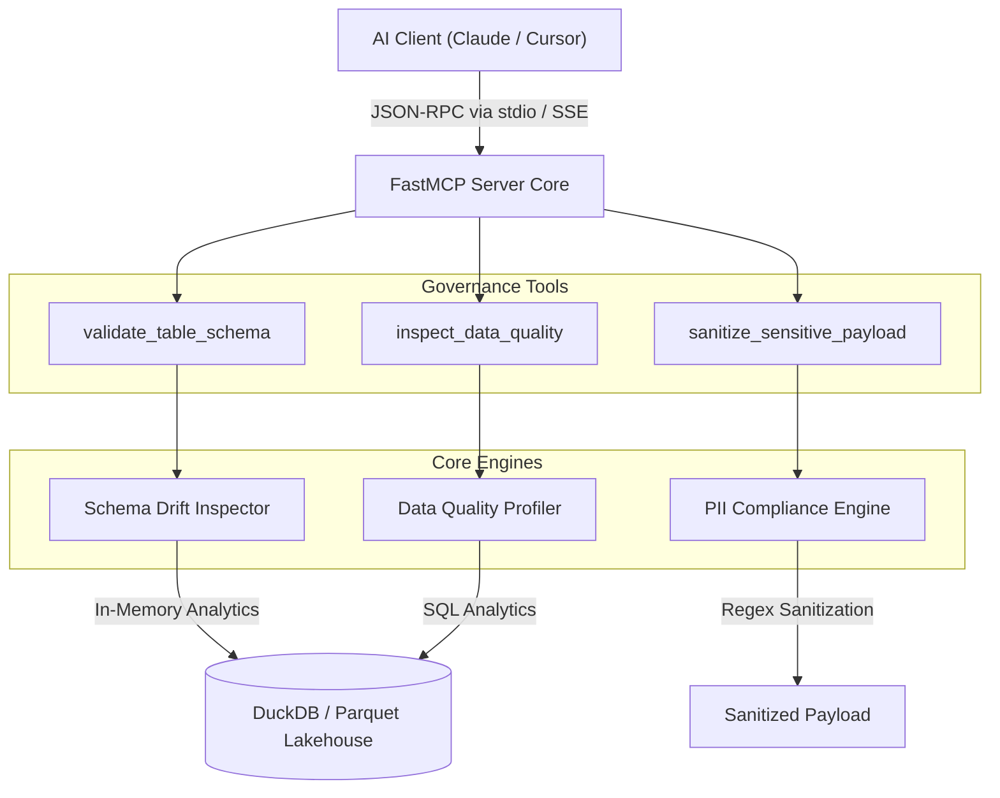

# Enterprise Data Governance & Quality Agent (MCP)

[](https://github.com/richardwijaya04/enterprise-data-agent/actions/workflows/ci.yml)


[](LICENSE)

An autonomous Model Context Protocol (MCP) server for enterprise data governance, automated data contract verification, PII redaction, and data quality profiling, built with DuckDB and Pydantic.

## 🏗️ System Architecture



## ✨ Key Features

- **Schema Drift Detection** (`validate_table_schema`): Validates physical table schemas against strict `TableContract` definitions to catch missing columns, unexpected fields, and type mismatches.
- **PII Sanitization & Guardrails** (`sanitize_sensitive_payload`): High-performance engine that detects and redacts sensitive data (emails, credit card numbers, phone numbers) before LLM processing.
- **Automated Data Quality Profiling** (`inspect_data_quality`): Calculates null percentages, identifies duplicate rows, and computes an overall data health score.

## 🚀 Quickstart Guide

### Prerequisites

- Python 3.12+
- [uv](https://docs.astral.sh/uv/) package manager

### 1. Installation & Environment Setup

```bash
git clone https://github.com/richardwijaya04/enterprise-data-agent.git
cd enterprise-data-agent

# Pin Python version and sync virtual environment
uv python pin 3.12
uv sync --all-extras --dev
source .venv/bin/activate
```

### 2. Generate Synthetic Test Warehouse

```bash
uv run python -m enterprise_data_agent.core.mock_data
```

### 3. Run Automated Test Suite

```bash
uv run pytest --cov=src
```

### 4. Container Deployment (Docker)

```bash
# Build lightweight multi-stage image
docker build -t enterprise-data-agent .

# Run containerized MCP server
docker run -p 8000:8000 enterprise-data-agent
```

## 🧪 Engineering Standards

- **Testing**: TDD methodology with `pytest` (>85% coverage enforced via CI)
- **Code Hygiene**: Strict formatting and linting via `ruff`
- **CI/CD**: Automated GitHub Actions build & test pipeline

## 📄 License

Released under the [MIT License](LICENSE).
